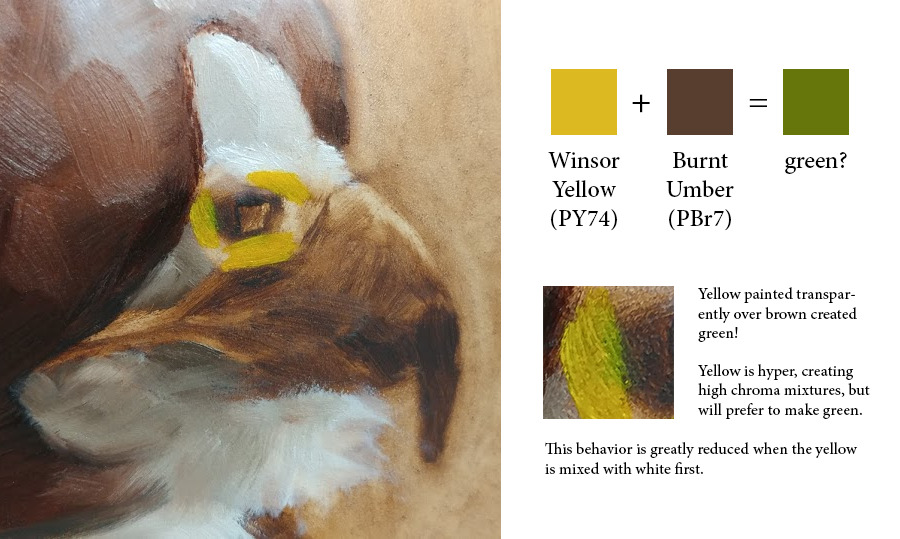
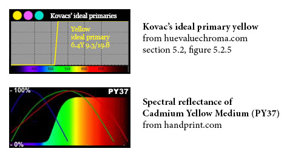

# Yellow + Brown = Green!

An interesting thing happened when painting “Ignorance.” I was blocking in some strong yellows over the umber underpainting when I was surprised to find a spot of green!

Those swatches above were collected using the color picker in Photoshop. The warmth of the rest of the painting makes the green look more vibrant than it really is, but it is undoubtedly green!

Yellow is hyper, creating high chroma mixtures in part because it is a subtractive primary color (giving its mixtures [the shape of an extroverted octopus](http://www.huevaluechroma.com/061.php#primaries), with arms along the edge of the color wheel), with the bonus that its spectral reflectance curve resembles a mathematically ideal primary:

(Above image compiled from [fig. 5.2.5](http://www.huevaluechroma.com/pics/5.2.5.jpg) on [huevaluechroma.com](http://www.huevaluechroma.com/052.php), and the [spectral reflectance of some cadmium yellows](https://www.handprint.com/HP/WCL/IMG/RC/PY35.html) from [handprint.com](https://www.handprint.com/HP/WCL/watery.html).)

Everyone knows yellow will make a greenish color when mixed with black. But in my own experiments pure yellow mixtures almost always lean green, even when mixed with something extreme like purple. And on my glass palette a blob of pure yellow will have a green shadow. But with brown? Even with brown it wants to make greens?!

Granted, yellow and brown won’t make green when mixed, and any amount of white will make yellow behave much more normally, but yellow definitely has a talent for making green. I would like to know the reason for this… and I think I read somewhere that the part of the spectrum yellow reflects is more persistent in the greens but I can’t find where I read that. (Remember that yellow pigments reflect red, orange, yellow, and green. Yellow doesn’t create green: the green was inside yellow all along!) The best I could find were a [series of spectrum reflectance curves for mixed greens](https://www.handprint.com/HP/WCL/IMG/greens.jpg) with a consistent green spike (despite the highs of the constituent pigments being in different places), and even one for [yellow and magenta](https://www.handprint.com/HP/WCL/IMG/RC/reflectxmy.jpg) with a green spike.

I imagine that this behavior from yellow is part of why traditional color theory (RYB) is so persistent among traditionally-trained artists: modern color theory (CMY) is not a good model for predicting that yellow + blue = green, whereas it’s a given in traditional color theory. (Traditional color theory is poorer at predicting color mixes in basically every other respect, but this feature is hard to ignore.)
